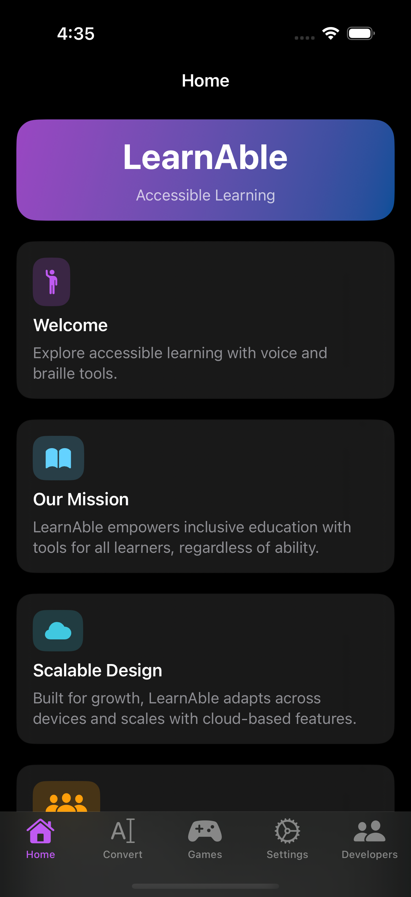
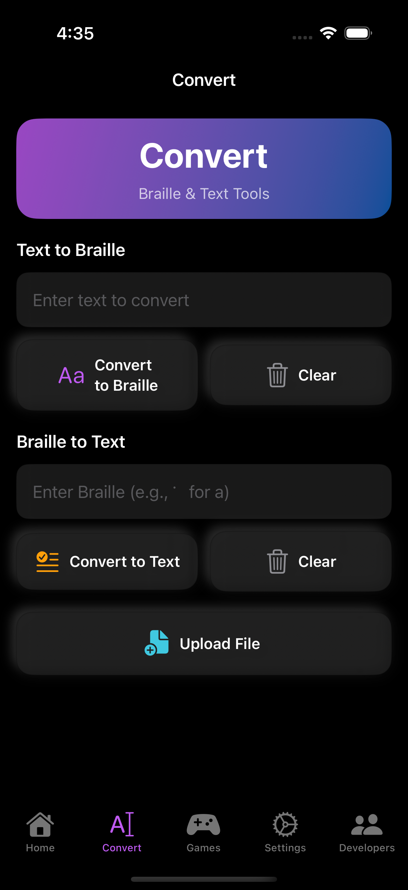
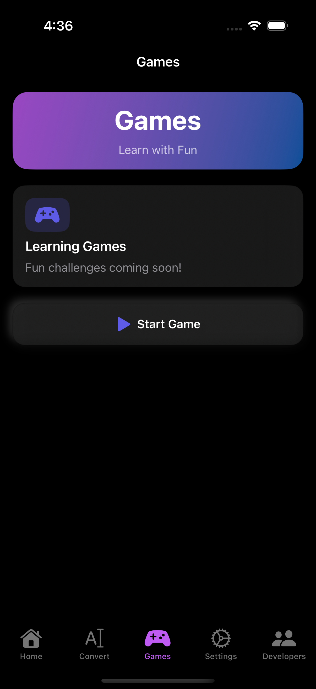
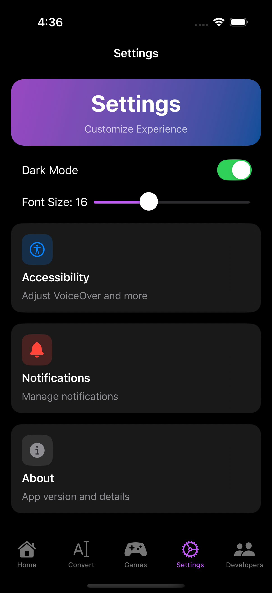
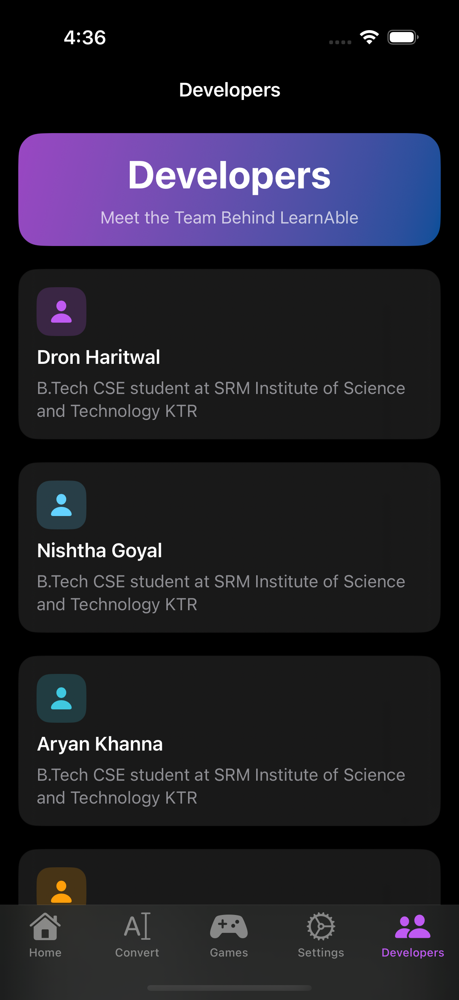

LearnAble
Overview
LearnAble is an accessible learning application designed to empower users with tools for inclusive education. It combines voice and braille functionalities to cater to diverse learning needs, making education more accessible for everyone.
Screenshots
Below are some screenshots showcasing the key features of LearnAble:
Home screen with voice interaction options
Convert screen for text-to-braille and braille-to-text conversion
Games screen with upcoming educational challenges
Settings screen for customizing the app experience
Developers screen highlighting the team behind LearnAble
## Screenshots
Below are some screenshots showcasing the key features of LearnAble:

*Home screen with voice interaction options*
  

*Convert screen for text-to-braille and braille-to-text conversion*
  

*Games screen with upcoming educational challenges*
  

*Settings screen for customizing the app experience*
  

*Developers screen highlighting the team behind LearnAble*
  
Features

Voice Interaction: Utilize text-to-speech and speech-to-text capabilities to engage with the app hands-free.
Braille Conversion: Convert text to braille and vice versa, supporting users who rely on braille for reading and writing.
Customizable Interface: Switch between light and dark modes, and adjust font sizes to suit individual preferences.
Educational Games: Explore a growing collection of fun, educational games to enhance learning experiences.
Developer Information: Learn about the team behind the app and their contributions.

Installation

Clone the repository:git clone https://github.com/yourusername/LearnAble.git

Open the project in Xcode.
Build and run the app on a simulator or physical iOS device.

Usage

Navigate through the app using the tab bar (Home, Convert, Games, Settings, Developers).
Enable speech feedback or use the microphone to interact with the app.
Input text or braille to convert between formats in the Convert section.
Adjust settings like dark mode and font size to personalize your experience.

Contributing
We welcome contributions! To get started:

Fork the repository.
Create a new branch for your feature or bug fix.
Submit a pull request with your changes.

License
This project is licensed under the MIT License. See the LICENSE file for details.
Contact
For questions or support, please open an issue in the repository or contact the developers via the app's Developers section.
LearnAble
Overview
LearnAble is an accessible learning application designed to empower users with tools for inclusive education. It combines voice and braille functionalities to cater to diverse learning needs, making education more accessible for everyone.
Screenshots
Below are some screenshots showcasing the key features of LearnAble:
Home screen with voice interaction options
Convert screen for text-to-braille and braille-to-text conversion
Games screen with upcoming educational challenges
Settings screen for customizing the app experience
Developers screen highlighting the team behind LearnAble
Features

Voice Interaction: Utilize text-to-speech and speech-to-text capabilities to engage with the app hands-free.
Braille Conversion: Convert text to braille and vice versa, supporting users who rely on braille for reading and writing.
Customizable Interface: Switch between light and dark modes, and adjust font sizes to suit individual preferences.
Educational Games: Explore a growing collection of fun, educational games to enhance learning experiences.
Developer Information: Learn about the team behind the app and their contributions.

Installation

Clone the repository:git clone https://github.com/yourusername/LearnAble.git

Open the project in Xcode.
Build and run the app on a simulator or physical iOS device.

Usage

Navigate through the app using the tab bar (Home, Convert, Games, Settings, Developers).
Enable speech feedback or use the microphone to interact with the app.
Input text or braille to convert between formats in the Convert section.
Adjust settings like dark mode and font size to personalize your experience.

Contributing
We welcome contributions! To get started:

Fork the repository.
Create a new branch for your feature or bug fix.
Submit a pull request with your changes.

License
This project is licensed under the MIT License. See the LICENSE file for details.
Contact
For questions or support, please open an issue in the repository or contact the developers via the app's Developers section.
